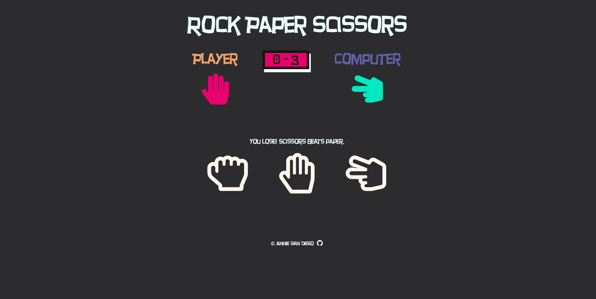
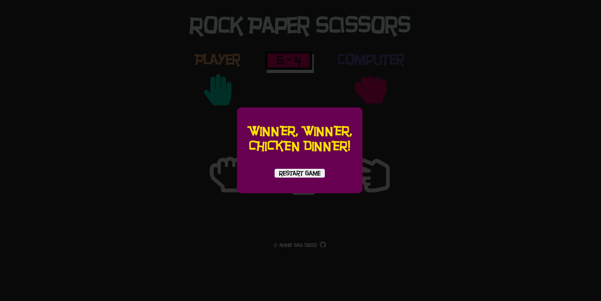
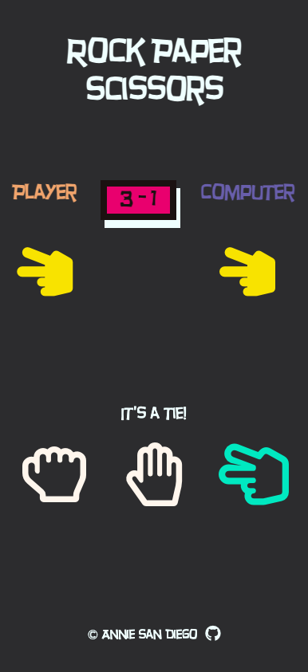
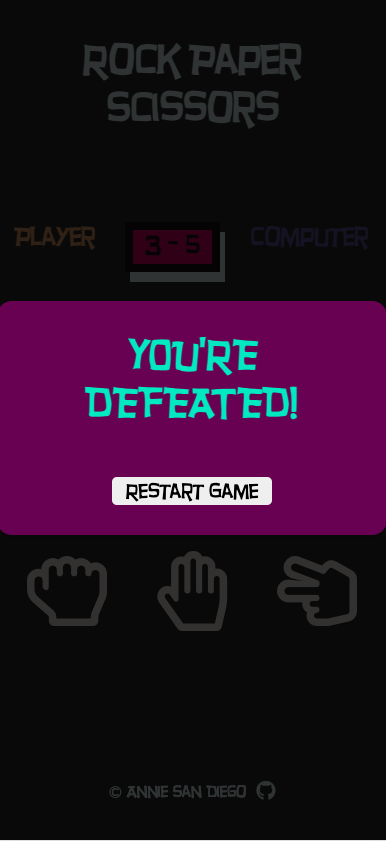

# The Odin Project - Rock-Paper-Scissors Game

This is a solution to the Rock-Paper-Scissors Project on [The Odin Project](https://www.theodinproject.com/lessons/foundations-rock-paper-scissors).

## Table of contents

- [Overview](#overview)
  - [Screenshot](#screenshot)
  - [Links](#links)
- [My process](#my-process)
  - [Built with](#built-with)
  - [What I learned](#what-i-learned)
  - [Continued development](#continued-development)
  - [Useful resources](#useful-resources)
- [Author](#author)

## Overview

### Screenshots

Desktop View

Mobile View

### Links

- Solution URL: [https://github.com/amsandiego/odin-rock-paper-scissors](https://github.com/amsandiego/odin-rock-paper-scissors)
- Live Site URL: [https://amsandiego.github.io/odin-rock-paper-scissors/](https://amsandiego.github.io/odin-rock-paper-scissors/)

## My process

### Built with

- HTML5
- CSS3
- Flexbox
- JavaScript

### What I learned

As my first JS personal project from scratch, this was a great learning experience to solidify my foundations on the holy trinity of web development. The project was built in iterations: first, as a game playable only via prompts and console logs, then the UI design materializing from a paper sketch, and finally integration of the UI with JavaScript (and a ton of refactors) to make the final game.

Key things I learned:

- HTML DOM Methods, Events, and Properties
- CSS Reset
- Flexbox
- CSS Combinators
- CSS Pseudo-classes
- How to create a pop-up modal box

### Continued development

- Implement semantic HTML
- Improve use of units for more responsive design (e.g. rem for font-size)
- Improve mobile layout

### Useful resources

- [How to Create Popup Modal Box in HTML CSS & JavaScript](https://www.youtube.com/watch?v=X4hkueyp7zY) This video served as my guide in creating the pop-up modal. What I changed is when the modal will be triggered - instead of a button to be clicked, the modal will be shown when the game ends.

## Author

- GitHub - [amsandiego](https://github.com/amsandiego)
